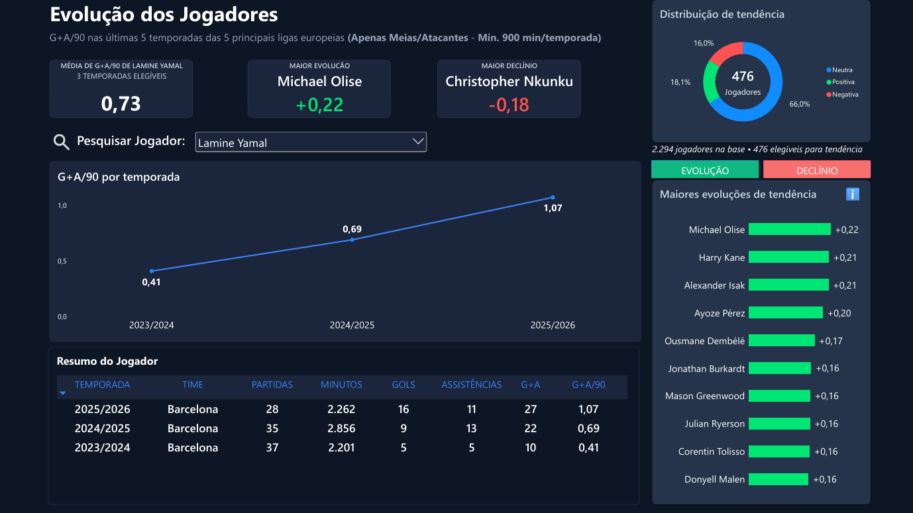
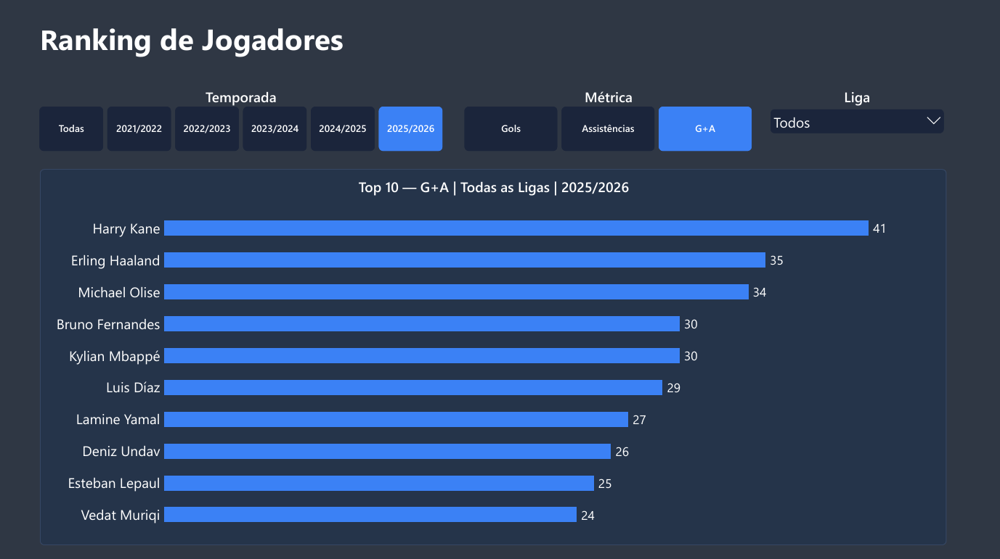

# Análise de Desempenho e Evolução de Jogadores — Top 5 Ligas Europeias

Projeto de análise de dados aplicado ao futebol europeu, com pipeline completo de coleta, tratamento, modelagem em banco relacional e visualização em Power BI.

O foco é analisar o desempenho dos jogadores e identificar tendências de evolução ou declínio ao longo das temporadas. A análise também busca evitar conclusões baseadas em poucos dados ou em variações que podem acontecer naturalmente de uma temporada para outra.

## 1. Descrição

O projeto coleta dados de jogadores das cinco principais ligas nacionais da Europa ao longo das últimas cinco temporadas (2021/22 a 2025/26), trata e organiza essas informações em um banco SQL Server e constrói um dashboard em Power BI dividido em duas páginas: uma voltada para a evolução individual de jogadores ao longo do tempo e outra para ranking comparativo de desempenho por temporada.

A motivação não foi apenas mostrar estatísticas de futebol, mas também praticar um processo completo de análise de dados, desde a coleta e organização dos dados até a definição de critérios para medir a evolução dos jogadores de forma mais consistente, evitando que poucos dados ou variações isoladas influenciem demais os resultados.

## 2. Objetivo

* Praticar um pipeline de dados ponta a ponta: coleta → tratamento → SQL → BI.
* Aplicar critérios para medir tendência de desempenho ao longo do tempo, evitando conclusões precipitadas a partir de poucas observações.
* Construir um dashboard que comunique não apenas números, mas também o contexto e as limitações por trás deles.

## 3. Perguntas de negócio / análise

* Quais jogadores apresentam maior tendência de evolução ou declínio em G+A/90 ao longo das últimas temporadas?
* Essa tendência é consistente ao longo do período analisado?
* Quem lidera os rankings de gols, assistências e G+A em cada temporada dentro das cinco principais ligas?
* Como esses rankings mudam ao segmentar por liga, temporada e métrica?

## 4. Fonte e escopo dos dados

* **Fonte:** [FBref](https://fbref.com), coletado via Python com a biblioteca [`soccerdata`](https://github.com/probberechts/soccerdata).
* **Ligas:** Premier League, La Liga, Bundesliga, Serie A e Ligue 1.
* **Temporadas:** 2021/22 a 2025/26.
* **Escopo:** apenas jogos das competições nacionais de cada liga.
* Jogos de Champions League, Europa League e outras competições europeias não são considerados.

O foco é comparar o desempenho dos jogadores dentro do contexto de suas respectivas ligas nacionais.

## 5. Critérios e regras da análise

Os critérios foram definidos ao longo do desenvolvimento do projeto para reduzir o impacto de amostras pequenas e variações isoladas nos resultados.

| Critério                                     | Valor                                                               | Motivo                                                                                            |
| -------------------------------------------- | ------------------------------------------------------------------- | ------------------------------------------------------------------------------------------------- |
| Minutos mínimos por temporada                | 900 minutos                                                         | Reduz o impacto de amostras pequenas nas métricas por 90 minutos.                                 |
| Temporadas mínimas para cálculo de tendência | 4 temporadas                                                        | Garante uma quantidade maior de observações para estimar a direção da evolução ao longo do tempo. |
| Classificação de tendência                   | Positiva: > +0,05 · Negativa: < −0,05 · Neutra: entre −0,05 e +0,05 | Evita classificar pequenas variações próximas de zero como tendência positiva ou negativa.        |
| Escopo de competições                        | Apenas jogos da liga nacional                                       | Mantém o contexto competitivo da análise consistente.                                             |

## 6. Tecnologias utilizadas

| Camada                        | Ferramenta           |
| ----------------------------- | -------------------- |
| Coleta de dados               | Python, `soccerdata` |
| Tratamento e limpeza          | Python, Pandas       |
| Armazenamento                 | SQL Server           |
| Modelagem e regras de negócio | SQL (views)          |
| Visualização                  | Power BI             |
| Versionamento                 | Git / GitHub         |

## 7. Pipeline do projeto

```text
FBref
  ↓
Coleta de dados
Python + soccerdata
  ↓
Dados brutos
CSV
  ↓
Limpeza e tratamento
Pandas
  ↓
Dados tratados
CSV limpo
  ↓
SQL Server
  ↓
Views SQL
Regras e métricas de negócio
  ↓
Power BI
Modelo de dados + visualizações
  ↓
Dashboard
Evolução dos Jogadores + Ranking de Jogadores
```

O fluxo foi organizado por camadas, separando coleta, tratamento, armazenamento, regras de negócio e visualização.

Essa separação facilita a manutenção do projeto e reduz a duplicação de lógica entre SQL e Power BI.

## 8. Tratamento e preparação dos dados

As principais etapas realizadas com Pandas incluem:

1. **Consolidação dos Dados:** Leitura e concatenação de múltiplos arquivos CSV de diferentes caminhos em um único DataFrame bruto, exportado como `DadosFUTBrutos.csv`.

2. **Achatamento de Cabeçalho:** Transformação do cabeçalho multinível (MultiIndex) em um formato simples de nível único, unindo os títulos com `_` e renomeando as variáveis.

3. **Seleção de Atributos:** Seleção das colunas necessárias para a análise, incluindo tanto os números absolutos quanto as métricas por 90 minutos já calculadas pela fonte original. O código não calcula a métrica G+A/90, apenas seleciona e renomeia a coluna existente.

4. **Filtragem de Posição:** Aplicação de filtro para manter jogadores classificados como meio-campistas ou atacantes (`MF` ou `FW`).

5. **Corte por Minutagem:** Aplicação da regra de negócio principal da análise, mantendo apenas jogadores com mais de 900 minutos em campo.

6. **Tradução do Dicionário de Dados:** Renomeação das colunas mantidas na base de inglês para português, como `Gls_90` para `gols_90`.

7. **Validação e Exportação:** Verificação dos dados e exportação do resultado final para o arquivo `DadosFUTLimpos.csv`. Não há, neste notebook, uma etapa de ligação ou preparação dos dados para o SQL Server.
## 9. Banco de dados / SQL

Os dados tratados são carregados em uma tabela base `DadosFUTLimpos` no SQL Server, com granularidade de jogador por temporada.

A partir dessa base, foram criadas views para concentrar regras de negócio e cálculos utilizados pelo dashboard.


**Principais views:**

- **`vw_RankingTendenciaJogadores`** — calcula a tendência de G+A/90 de cada jogador por meio de regressão linear, considerando o critério mínimo de 4 temporadas elegíveis.
- **`vw_KPI3_MaiorEvolucao`** — retorna o jogador com maior tendência positiva dentro da amostra elegível.
- **`vw_KPI2_MaiorDeclinio`** — retorna o jogador com maior tendência negativa dentro da amostra elegível.
- **`vw_KPI4_PercentualTendencias`** — calcula a distribuição percentual de jogadores entre tendência positiva, negativa e neutra, a partir do resultado de `vw_RankingTendenciaJogadores`.
- **`vw_DadosJogadorTemporada`** — fornece os dados utilizados pelos indicadores e análises individuais no Power BI.
- **`vw_pagina2_ranking`** — fornece os dados de gols, assistências e G+A por jogador e temporada utilizados no ranking comparativo da página 2.

A decisão de concentrar o cálculo da regressão linear no SQL foi adotada para evitar a duplicação da mesma lógica em diferentes camadas do projeto.

## 10. Dashboard no Power BI

O dashboard é dividido em duas páginas com objetivos diferentes.

### Página 1 — Evolução dos Jogadores



A primeira página é dedicada à análise da trajetória individual dos jogadores ao longo das temporadas.

Principais elementos:

* Busca de jogador.
* Gráfico de G+A/90 por temporada.
* Resumo estatístico do jogador.
* Partidas, minutos, gols, assistências e G+A.
* Média de G+A/90 ponderada por minutos.
* Ranking de maior evolução.
* Ranking de maior declínio.
* Distribuição de tendência entre positiva, neutra e negativa.

Os rankings de evolução e declínio consideram apenas jogadores com quantidade mínima de temporadas elegíveis, reduzindo o impacto de variações isoladas.

### Página 2 — Ranking de Jogadores



A segunda página é voltada para a comparação de desempenho dos jogadores dentro de um recorte específico.

Principais elementos:

* Segmentação por temporada.
* Segmentação por métrica.
* Segmentação por liga.
* Ranking Top 10 dinâmico.
* Métricas de gols, assistências e G+A.
* Filtro mínimo de 900 minutos por temporada.

Os rankings consideram apenas partidas das ligas nacionais analisadas.

## 11. Principais métricas e lógica das análises

### G+A/90

**G+A/90** representa a quantidade de gols e assistências produzidos pelo jogador a cada 90 minutos.

A métrica permite comparar jogadores com diferentes volumes de minutos jogados, reduzindo a influência direta do tempo total em campo.

Como se trata de uma taxa, ela pode ser mais sensível a amostras pequenas. Por isso, o projeto utiliza um mínimo de **900 minutos por temporada** antes das análises.

### Tendência

A tendência é calculada utilizando uma regressão linear sobre o G+A/90 de cada jogador ao longo das temporadas elegíveis.

O coeficiente angular (**slope**) representa a direção da variação ao longo do tempo:

* **Slope positivo:** tendência de aumento.
* **Slope negativo:** tendência de redução.
* **Slope próximo de zero:** pouca variação sistemática.

Para reduzir a influência de variações isoladas, o projeto exige um mínimo de **4 temporadas elegíveis** para o cálculo da tendência.

Além disso, foi definida uma faixa neutra entre **-0,05 e +0,05**, evitando classificar pequenas variações como tendências positivas ou negativas.

Os resultados devem ser interpretados dentro da amostra analisada e não como uma avaliação absoluta da carreira de um jogador.

## 12. Estrutura de pastas do repositório

```text
projeto-futebol/
├── dados/
│   ├── Bruto/
│   └── Limpo/
├── scripts/
├── notebooks/
├── sql/
├── powerbi/
├── docs/
│   └── images/
├── .gitignore
└── README.md
```

## 13. Como executar / reproduzir o projeto

1. Clone o repositório.
2. Instale as dependências Python utilizadas no projeto.
3. Execute os scripts de coleta para obter os dados do FBref.
4. Execute o processo de tratamento dos dados.
5. Gere o CSV tratado.
6. Carregue os dados no SQL Server.
7. Execute os scripts SQL para criação das views.
8. Abra o arquivo `.pbix` no Power BI.
9. Configure a conexão com o banco SQL Server.
10. Atualize os dados no Power BI.

## 14. Limitações do projeto

* O cálculo de tendência usa a variação absoluta de G+A/90, não relativa. Isso significa que jogadores com um ponto de partida muito alto (ex.: já entre os melhores da posição) tendem a aparecer no ranking de declínio por efeito de regressão à média — uma tendência estatística natural de aproximação da média histórica após um pico, não necessariamente uma queda real de nível — enquanto jogadores que partem de um patamar baixo podem aparecer com tendências de evolução desproporcionalmente altas em termos relativos.
* A regressão linear não diferencia automaticamente uma evolução gradual de uma mudança de patamar causada por uma mudança de clube ou contexto.
* G+A/90 não separa gols de pênalti dos demais gols.
* A análise não realiza ajuste específico por posição ou função tática.
* Os rankings de totais da Página 2 podem ser influenciados por diferenças no número de partidas disponíveis em cada liga e temporada.
* A base não registra a posição do jogador por temporada, apenas o jogador em si — o que significa que mudanças de função ao longo da carreira não são capturadas. Um exemplo é o Frimpong: hoje atua como lateral pelo Liverpool, mas em temporadas anteriores é possível que tenha atuado como ala, uma função com expectativa de produção ofensiva diferente. Sem essa informação, a métrica de tendência trata toda a série do jogador como se ele tivesse exercido a mesma função do início ao fim, o que pode distorcer a leitura de "evolução" ou "declínio" quando, na verdade, parte da mudança reflete uma troca de posição, não uma mudança de nível técnico.

## 15. Possíveis melhorias futuras

* Substituir a faixa fixa de tendência por intervalos de confiança do coeficiente angular.
* Segmentar as análises por posição.
* Adicionar análise por faixa etária.
* Identificar mudanças de clube no gráfico de evolução.
* Adicionar métricas como gols sem pênalti e xG quando disponíveis.
* Normalizar rankings de totais considerando o número de jogos disputados.
* Adicionar novas métricas de desempenho ofensivo e defensivo.
* Comparar diferentes métodos estatísticos de identificação de tendência.

## 16. Conclusão

O projeto foi desenvolvido para aplicar um fluxo completo de análise de dados, desde a coleta e tratamento das informações até a modelagem em SQL Server e visualização no Power BI.

Além da construção do dashboard, o projeto busca demonstrar a importância de definir critérios metodológicos antes de interpretar os resultados.

O uso de um mínimo de minutos por temporada, um número mínimo de temporadas para análise de tendência e uma faixa neutra para pequenas variações ajuda a reduzir interpretações baseadas apenas em oscilações isoladas.

Dessa forma, o projeto combina **Python, SQL e Power BI** em um único fluxo de análise aplicado a dados reais de futebol.

## 17. Autor

Desenvolvido por **Gustavo Gomes** como projeto de portfólio em **Análise de Dados / Business Intelligence**.
